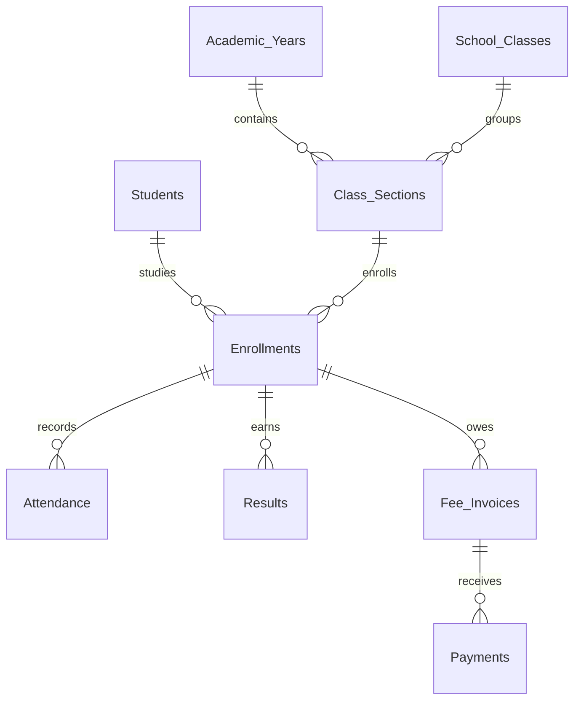
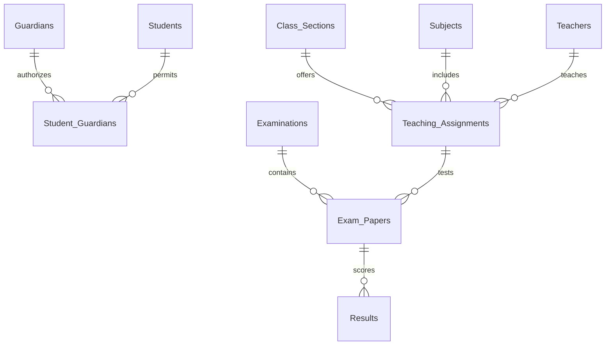

# School Management System architecture

Prepared for Ajay S and The IT Guy. This package contains implementation source and a locally tested reference model. It is not an exported or verified live Zoho tenant.

## Data structure

CRM is the source of truth. Students have one permanent auto-number Student ID (`Students.Name`) and separate Enrollments for each academic year. Class Sections point to a School Class and Academic Year. Teaching Assignments connect a section, subject and teacher. Attendance, results and fee invoices reference the enrollment rather than overwriting a student's previous year.

See FIELD_DICTIONARY.md and schema/crm_schema.json for the 18 custom modules and all field contracts. The 18th module, Fee Follow Ups, implements the extra feature. Existing Leads remains the admission enquiry module. CRM Tasks can capture admission follow-ups without another custom module.

## Admission and academic history

The webform creates a Lead with New admission status. Staff move it through Contacted, Visit Scheduled, Documents Pending and Approved, or Rejected. Approval is a human decision. Only an approved record with parent consent, a verified guardian, a chosen section and an enrollment start date can invoke admission processing. A custom Student record is created instead of using CRM's standard Lead-to-Contact conversion, because student identity and annual enrollments need a school-specific model. The original Lead remains as admission history with a student lookup.

Admission uses the Lead ID as a unique creation key. Each enrollment has a unique student-plus-year key and a second active-student key. Promotion closes the prior enrollment and creates another record. This supports annual promotion, not concurrent enrollment or midyear section transfers. Promotion is an administrator-only serialized operation; CRM does not provide a transaction across these separate writes. If it partially fails, the error includes a recovery instruction and the same request can be retried.

## Attendance and examinations

Daily attendance requires an enrollment and an explicitly configured School Day. Future dates, dates outside enrollment, invalid statuses and contradictory duplicate requests are rejected. Present and Late count as present; Absent counts only in the denominator; Excused is excluded. A zero denominator is undefined, not zero percent. Marked and Unmarked Days accompany the recorded attendance percentage so incomplete registers are visible.

Results require the student's section, the examination section and the teaching assignment section to agree. Marks are nonnegative and bounded by the paper's maximum; absence requires zero marks. Maximum and pass marks are saved as snapshots. Parents see only published examinations. Academic reports use SUM(Marks) divided by SUM(Max Marks Snapshot), not a simple mean of paper percentages when papers have different maxima.

## Fees and installments

Each invoice is a charge for one enrollment. Payments remain separate ledger records with unique references. Retrying the same payment is harmless; changing the amount behind an existing reference is a conflict. Cached CRM totals are recomputed from posted payments. The Creator fees view calculates its balance from the ledger at read time instead of trusting potentially stale cached totals. Overpayments appear as credit; this avoids pretending that a pre-read balance check would be safe under concurrent payments.

Voids require administrator review and a reason, and retain the payment record. Run fee reconciliation after a void. No real payment gateway, payment collection, refund execution or bank reconciliation is claimed.

## Parent application and integration

Creator holds the parent page and server-side Deluge functions. It does not copy student data into editable parent forms. A restricted, server-side CRM OAuth connection reads allowlisted fields. The signed-in portal email comes from `thisapp.portal.loginUserEmailid()`, never a URL argument. Its normalized SHA256 key resolves a verified, enabled Guardian. The function checks the live Student Guardian grant and verifies that the selected enrollment belongs to that student before each data query.

Creator page parameters can choose a child, enrollment, category and page number. They cannot choose a parent identity. Every untrusted value is validated; text rendered in HTML is escaped. Parent data stays private, read-only and unshared outside authenticated portal sessions. Revoke a grant or disable the guardian in CRM to deny the next page load. Already displayed information cannot be remotely erased from a parent's browser. Any email change requires re-verification.

The integration supports multiple children and academic history, with ten rows per data page. Empty data and service errors are distinct; failures show a message and no school records. Scheduled reconciliation handles CRM summaries; it is not required for parent access revocation.

## Additional feature

The overdue-fee work queue finds unpaid invoices before staff have to search manually. A bounded job recomputes each overdue invoice balance, creates a follow-up record keyed by invoice and review date, and stores a cursor to resume after errors. A repeated run cannot create a second item for the same invoice on the same date. Staff can mark items resolved after action. Each new date can produce a new item while an invoice remains unpaid. It is an internal work queue, not an automatically sent collection message.

This deterministic feature offers clear value without sending student records to an external AI service. No LLM is needed for admission approval, grades, parent authorization or money calculations.

## Scale and limits

Database uniqueness protects creation keys; searches alone do not. COQL aggregate queries calculate ledger totals; keyset pagination bounds scheduled batches to 25 records. Parent queries request selected fields and paginate. Per-parent child and enrollment lists are limited to 200 and fail closed if exceeded. API quotas, function runtime, portal entitlements and custom-module limits must be checked in the actual trial. Larger deployments should partition reconciliation, monitor job lag, and use load-test evidence before increasing batch size.

This is a single-school implementation with INR and Asia/Kolkata defaults. Multi-school tenancy, concurrent academic programs, self-service online payments and midyear transfers are outside the implemented scope.
